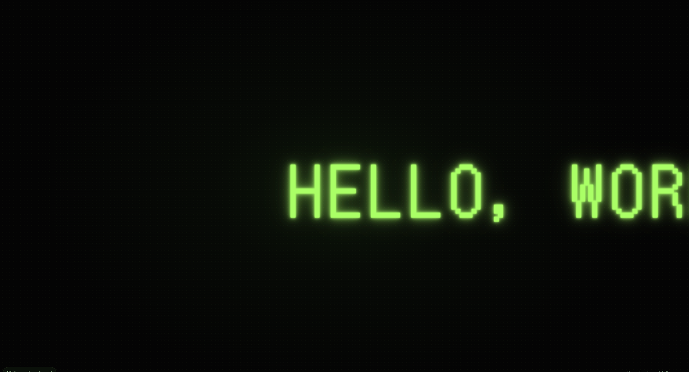

# 💡 Neon - LED Message Scroller (Offline PWA)

A minimalist **Progressive Web App** that turns your screen into a glowing, scrolling LED message board.  
Now with **one-tap sharing** and an **Install** button that appears only when the app isn’t installed.

---

## 🚀 Features

- 🌐 **Works fully offline** (Service Worker cache-first)
- ⬇️ **Installable PWA** (shows **Install** button only when eligible)
- 🔗 **Share any message** via a link (`?msg=...&autoplay=1`)
- 📲 **Recipients auto-open your message** and can install the app
- 🖋️ **DotGothic16** pixel font via Google Fonts, **auto-cached** for offline
- 🎨 Change message and UI color — choose between Green, Blue, Pink, or White (persists between visits)
- 🧠 **Smart scroll speed** adapts to message length
- ♿ Keyboard: **Enter** to display, **Esc** or click to exit
- 🍏 iOS helper: shows **Add to Home Screen** tip where the prompt isn’t supported

